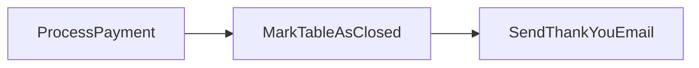
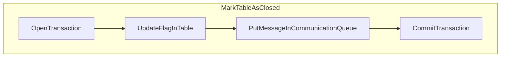
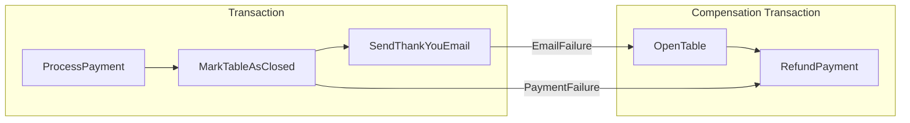
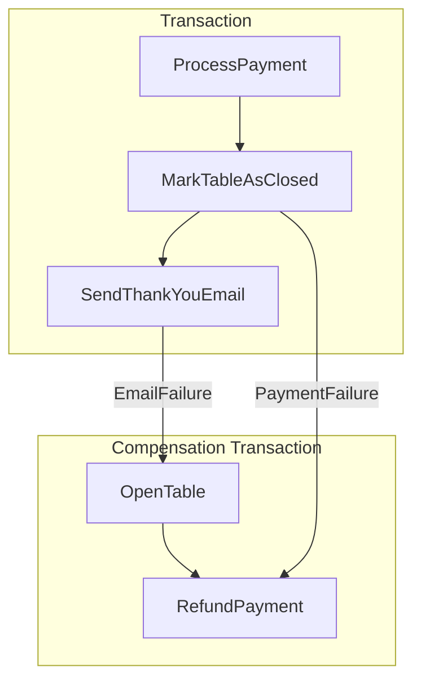
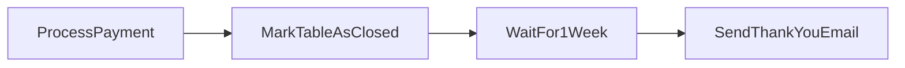
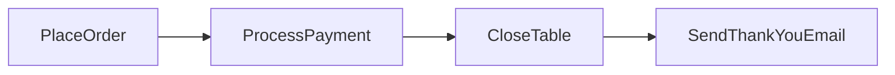
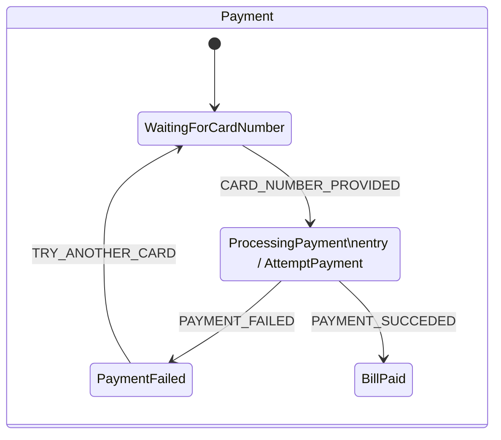
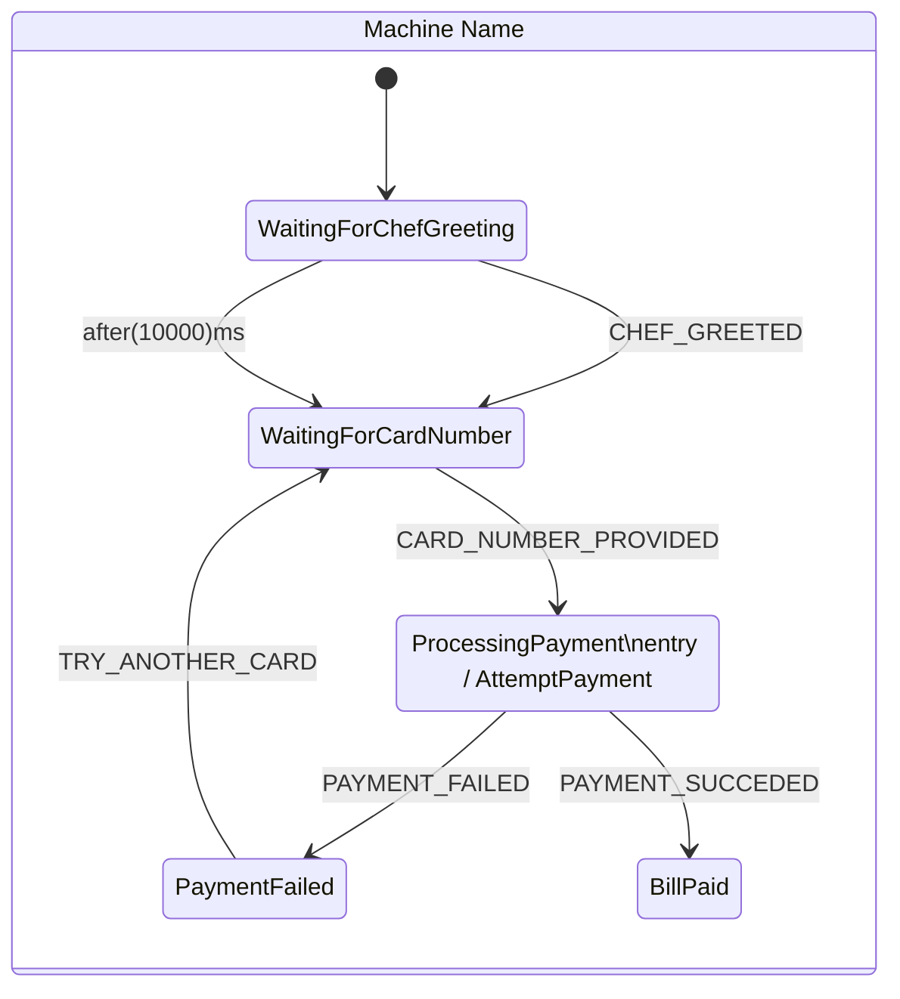

---
layout: fact
---

# THANK YOU ORGANIZERS!
---
layout: image-right
image: /image-restaurant.jpg
---

## 🤌 Italian Restaurant 🤌
<br/>

- Customer is seated to a table
- The customer places his order
- The kitchen cooks the food
- The customer eats the food
- The customer pays

...gotta go Fast!

<!--
I want to tell you a story, a story about a very special restaurant, lost in the peaks of an unknown mountain in a very small village in Italy.

This village is very special, people say that it is an entirely different dimension, where time has stopped.

People come in and have a seat, order their food, the kitchen cooks the food, people eat and have a coffee, pay and leave, in less than a blink of an eye.

In this village, a young fullstack developer decided to build a restaurant manager application to help his dad drive the restaurant to success.
-->

---

# /api/process

```ts{all}
export function postProcess(payload){
  seatPeople(payload.tableId, payload.seatCount)
  placeOrder(payload.tableId, payload.menuItemId, payload.amount)
  const amountDue = askForBill(payload.tableId)
  removeFromBalance(payload.cartNumber, amountDue)
  markAsPayed(payload.tableId)
  sendThankYouEmail(payload.email)
}
```

<!--
He builds his application using React, and his backend API has only a single endpoint.

http://localhost/api/process

This single endpoint receives the name of the customer, the order and the payment information to proceed calculating the bill of each order and performing the payment.

A pseudo implementation of this endpoint may look like the one we see here, were we first seat people at a table, we place an order for some items, we then ask for the bill and enventually send a thank you email.
-->

---
layout: fact
---

## A tale of Success

<!--
The application is perfect, it works so well, and his dad is so proud of him that finally he says what the boy was waiting years for.

“It’s time for you to leave this small village son, go out, and seek your glory into the real world. Just beware, it’s really different from here, and also there are bad people that break spaghetti before cooking them just because they don't fit the pot, they are the worst.”

The young boy leaves his village, and arrives here in Alicante, and starts knocking every restaurant’s door, trying to sell his application.
-->

---
layout: image-right
image: /image-restaurant-success.jpg
---

## Modeling software around the Real World
<br/>

- People arrive and seat
- Choose what to eat (lot of time!)
- The waiter takes the order (and brings it to kitchen)
- The chef cooks (time again!)
- Food is served and people eat (guess what? time!)
- Customer request the bill and pay

<!--
He quickly realized that his dad was right, the real world is very different from his hometown village.

People arrive at the restaurant and take a look at the menu. (I usually take a lot of time for that)
The waiter comes and people place their order.
The kitchen starts cooking.
Food is served.
The customer have a coffee and leaves.
-->

---
layout: image-left
image: /image-time.jpg
---

## We have been LIED
<br/>

- Everything takes time to happen
- The waiter waited for us to choose
- The owner waited before placing the bill

<!--
Everything takes time to happen.
It may be a very small amount, or it could be hours, but everything takes time.
And software should be built around real world needs right?

Our young developer learned the hard truth about the world. Nothing is synchronous.

Most of the processes happens over time, and over time they may wait for some condition to happen or process to complete before moving on to the next step.

Our waiter has waited for the customers to decide what to eat before taking the order.
The restaurant owner had to wait for the people to complete eating before placing the bill.
-->

---
layout: fact
---

## Long Running Process

<!--
Here we just acknowledged what a long running process is.

A long running process is a service that involves multiple steps, and will eventually need to stop in order to wait for an external input to proceed and continue processing. 

Before going on I want to clarify a few things, by long running I do not mean that the process is continuously running or waiting for a thread to unlock, but instead it’s long lived and may even span across months or years.
-->

---

## /api/seat
```ts{all}
export function postSeat(payload){
  seatPeople(payload.tableId, payload.seatCount)
}
```

## /api/order
```ts{all}
export function postOrder(payload){
  placeOrder(payload.tableId, payload.menuItemId, payload.amount)
```

## /api/checkout
```ts{all}
export function postCheckout(payload){
  const amountDue = askForBill(payload.tableId)
  removeFromBalance(payload.cartNumber, amountDue)
  markAsPayed(payload.tableId)
  sendThankYouEmail(payload.email)
}
```

<!--
Our young developer wants to quickly fix his application to jump as soon as possible to the market.
No problem right? Just need to split our old single API into multiple ones, and introduce some new UI to the application that will basically invoke each of the new API.

Now instead of receiving the whole payload at once, we will call one API at a time with only the data needed to process each step.

Persistence is required in order to make our new API work. Our single persistence-less API is now splitted up into multiple ones, and in this very simple implementation every time we split and need to wait for the user to call next api, we introduce a persistence step where we store our domain state.

And right now the first step of each API will be basically checking if the previous one actually happened.
-->

---
layout: two-cols
---

## API names


/api/checkout

/api/order

/api/seat

::right::

## Execution Flow

```ts{all}
export function postProcess(/* ... */){
  seatPeople(tableId, seatCount)
  placeOrder(tableId, menuItemId, amount)
  const amountDue = askForBill(tableId)
  removeFromBalance(cartNumber, amountDue)
  markAsPayed(tableId)
  sendThankYouEmail(email)
}
```

<!--
Another thing we notice here is that we kinda lost explicit information of what is the order of execution of those steps. 

Sure, as humans we may understand by just the names of the APIs which is the expected execution and call order, but what if we are discussing a flow that may contain up to 25 different steps; are you sure to be able to tell the correct execution order by just looking at the API names?

And imagine those being hidden into our code, that’s even worse, there is no explicit list of names to look up, you need to dig into the entire codebase to find out all the possible steps (hoping you don’t miss one!), and then try to lookup all the code checks to find out the correct order the services are expected to be called.

That sounds awesome, right?
-->

---


## How the Real World works: interleaved interactions
<br/>

- Customer A is seated to a table
- Customer B is seated to another table next to Customer A
- The waiter takes Customer A order
- The waiter takes Customer B order
- The kitchen receives both orders and cooks them
- The customers eats the food
- The customers pays only upon finishing their food

<!--
Now that we have gone fully asynchronous, we realize the things in real life happen in a completely different way.

When a customer arrives at a restaurant, it is greated seated.
Now, the waiter instead of staring at the table until the customer has chosen what to eat (and that would be very weird), another customer arrives and it is seated at another table.

Now the waiter goes to take the order from both customers, and finally delivers it to the kitchen.

Now the chef receives both orders at once, and may optimize by cooking both at once.
-->

---
layout: fact
---


## Is human interaction the only problem?

<!--
So did we just learned that human interactions are the things that force our application to go asynchronous?

Must a long running process span between minutes, hours, days or weeks and involve human interaction in order to be called so?

Or maybe the same apply to a set of automated operations that usually takes a few milliseconds but may take more due to unavailability of external systems like the payment provider?
-->

---

## /api/checkout
<br/>

```ts{all}
export function postCheckout(payload){
  const amountDue = askForBill(payload.tableId)
  removeFromBalance(payload.cartNumber, amountDue)
  markAsPayed(payload.tableId)
  sendThankYouEmail(payload.email)
}
```

<!--
Let's take a step back and have a look at our checkout function, here what we do is really simple, we get the amount to pay, we subtract the amount from the card balance, and then we mark the bill as payed.

Do you see any problem in here?
-->

---

# Transactions are a LIE too

```sql{all}
BEGIN TRANSACTION;
UPDATE card_balances SET balance = balance - 10 WHERE card_number = 42
UPDATE orders SET payed = 1 WHERE table_id = 1
COMMIT TRANSACTION;
```

<!--
Since day one of learning how to develop software with databases when we were young we have been tought that we need to wrap multiple writes into one transaction, in order to ensure data consistency, right?

With our BEGIN and COMMIT we were thought that we ensure that everything will either happen or completely fail, right?
-->

---

# And what do we do today?

```ts{all}
export function postProcess(payload){
  // ...
  fetch('http://payment.processor/?card=' + payload.cartNumber +
      + '&amount=' + amountDue)
  markAsPayed(payload.tableId) // goes BOOM! 🤯
  sendThankYouEmail(payload.email)
  // ...
}
```

<!--
And yet today we did not learn the lesson. 

What happens here for example if your payment processor succefully processed the payment, but your code somehow fails to mark your table as payed? I am sure that the customer won't be happy to try to pay again for the second time to see if the issue is fixed.
-->
---

# ...is it fixed now?

```ts{all}
export function postProcess(payload){
  try{
    beginTransaction();
    fetch('http://payment.processor/?card=' + payload.cartNumber +
        + '&amount=' + amountDue)
    markAsPayed(payload.tableId) // goes BOOM! 🤯
    sendThankYouEmail(payload.email)
    commitTransaction();
  }catch(e){
    rollbackTrasaction();
  }
}
```

<!--
How many of you forgot to put your begin transaction and commit transaction instructions around your external services call?

There is no magic begin commit and rollback function.

When dealing with different systems, like for example external APIs, databases, and even users, ACID transactions are not an available option.
-->

---
layout: image-right
image: /image-restaurant-2.jpg
---

## Real World Problems
<br/>

- Customer is seated to a table
- The customer places his order for a steak
- The kitchen finds out it's out of steak
- ...BOOM! 🤯

<!--
And is this a problem that only happens in code due to external services?

I would say that's not true, let's imagine the following:

- Customer is seated to a table
- The customer places his order for a steak
- The waiter delivers the order
- The kitchen finds out it's out of steak
- ...BOOM! 🤯

What do we do now? We cannot expect the real world to rollback as it never happened nothing.
-->

---
layout: fact
---

## Upfront checks aren't an option
What about possible downstream problems?

<!--
And we cannot also expect to be able to put a check upfront to avoid every possible failure that may happen downstream.

Back to our asynchronous restaurant we cannot expect the waiter to go check for the availability of each plate as the customer places an order for them. 

What would happen if for example there are two waiters each one serving a customer that would like to place an order for a steak each and only one is left in the fridge?

And even if somehow we put a global lock and prevent selling two steaks, what do we do if later the chef burns the food so we are left with no more steaks?
-->

---
layout: fact
---

## Long Running Process involve different systems

<!--
So as we just learned I would argue that there's no real difference in challenges of processes involving human interactions or being completely automated.

In both cases we are dealing and interacting with services that given an input, may perform some internal work that may involve calling external services and then broadcast new events as thing happens.
-->

---
layout: image-left
image: /image-old-computer.jpg
---

## User is an external service too
<br/>

- Input: screen
- Output: key presses and clicks

<!--
And if you think about it, every application has at least two system interacting.

The first one may be the application itself, and the second one is the user itself.
The user is just a service like any other that recives as input a question on the screen, it may take some time to decide, and then replies by clicking things on a screen.

-->


---
layout: fact
---

## ACID may exist only locally

<!--
The key thing is that as long we are trying to couple two different systems together, we cannot have classic ACID transactions.

So did we learn that ACID transactions are useless because we always have at least two systems? Not quite.

They exists, but they can be relied only into a local scope for each service. 
The software may perform consistent writes to its storage.
As user I can guarantee to always provide a response to each question I receive.
Does it mean that we can also guarantee that the interaction between these two systems will always be correct and consistent?
-->

---
layout: fact
---

## ...distributed transactions?

<!--
Well here we come to the concept of a distributed transaction.

The idea is, instead of having a big long transaction that spans the entire flow of multiple steps that could involve external systems as we have seen before, you could actually break it up into many smaller transactions, and perform them one after the other, and they are hold on together by some kind of messaging or signaling.
-->

---

## /api/checkout

<br/>



<!--
So back to our example of the checkout API we have a series of three local transaction to create our payment flow.

We first process our payment, and if the local transaction succed, we trigger the next one by some signal or some message, and when that completes, assuming that is successful, we trigger the final one.

This approach may seem very simple, but there are things to deal with.
-->


---

# A communication layer

- Is needed in order to connect each transaction
- Communication becomes part of the transaction as well

<br/>



<!--
Here we have just find out the first requirement of this kind of distributed transactions, which is a messaging or communication system.

And that is required in order to communicate between services and kick of next transaction as soon the previous one finishes, and that messaging and communication service can be implemented however you like, but again the key is that it is used to coordinate execution of all the steps.

And the other requirement is that this comunication step should be done with the lowest risk of failure inside our local transaction.

And that is because if that step fails, we end up stopping our entire flow with no signal to the other steps.
-->

---

## Two kinds of coordination: choreography
<br/>

```ts
module Payment
  on "BillRequested"
    processPaiment()
    raise event PaymentProcessed()
end module

module Table
  on "PaymentProcessed"
    closeTable()
    raise event TableClosed()
end module

module Satisfaction
  on "TableClosed"
    sendThankYouEmail()
    raise event ThankYouSent()
end module
```

<!--
The introduction of a communication system introduce two possibile ways of organize the coordination between the systems.

The first one is called choreography, and is based on a long chain of events.
Each service will basically listen for the previous event to be triggered, perform it's work, and then raise a communication event in order to continue processing.
-->

---
layout: two-cols
---

## Two kinds of coordination: 
<br/>

```ts
module Payment
  on "ProcessPaymentRequest"
    processPaiment()
    raise event PaymentProcessed()
end module

module Table
  on "CloseTableRequest"
    closeTable()
    raise event TableClosed()
end module

module Satisfaction
  on "SendThankYouEmailRequest"
    sendThankYouEmail()
    raise event ThankYouSent()
end module
```

::right::

## orchestration
<br/>
```ts
module CloseTableFlow
  raise event ProcessPaymentRequest()
  await PaymentProcessed()
  raise event CloseTableRequest()
  await TableClosed()
  raise event SendThankYouEmailRequest()
end module
```

<!--
The other option is called orchestration, and instead of placing the flow logic inside of each service, what we do instead is leave each service to perform its business, and instead rely on an external service that will listen to all the events raised by all the partecipants and coordinate all the steps to perform.

This second approach makes more clear the execution flow because now its again colocated in a single place instead of being spread all over the place.

-->
---

## Introducing new flows in our application
<br/>

```ts
module OfferLiquorFlow
  const liquorId = ProductId(42)
  const [tableId, numberOfGuest] = await event GuestSeated()
  await PaymentRequested()
  raise event PlaceOrder(tableId, liquorId, numberOfGuest)
end module
```

<!--

It is also better because if a new flow is introduced, let's say for example that when the bill is requested we whant to deliver a goodby liquor for free to the table, we do not need to change the code of the existing services, but instead we introduce a new orchestrator that listens for PaymentRequest, and places an order of a liquor automatically on the table based on the number of guest seated.
-->
---
layout: fact
---

## What happens with failures?

<!--
Imagine a longer flow with up to 25 transactions, and arriving at the 20th and decide that for some business rule you cannot continue.

Remember our food burnt example?

In an ACID transaction you can simply rollback and that's it as they never happened. Whathever you did before did'nt commits.

-->

---

## Compensate all the things!
<br/>



<!--

In a saga the catch is that instead you need to explicitly write a "compensating transaction" that basically undoes what its corresponding transaction did.

If a failure happens downstream, you need to ensure somehow that you'll be executing all the compensating transactions for each transaction you succefully performed before.

And in that wayyou can guarantee that your system will be someday back into a consistet state.
-->

---

## Three kind of transactions: Compensable
<br/>

- Define both the transaction and the compensating transaction
- Should not rely on "just setting the old value back"
- Should be commutative
- WareHouse and Accounting systems are great scenarios were you can find these

<!--
And by looking at our flow we basically discovered the three kind of transactions.

Compensable transactions are the one that may have a compensating action to be executed to cancel the effects that were applied by the transaction.

Place Order may be compensated by Cancel Order.

And that compensating transaction should not rely on just setting the old value back.

And that is because, if you remember correcly, once we went to an asynchronous flow, each step started to interconnect.

Process Payment of 10 euros may be compensated by Process Refund of 10 euros, not trying to set back the balance to the previous amount.
-->

---

## Three kind of transactions: Retriable
<br/>

- Can't fail but instead may be retried infinitely

<!--
Another kind of transaction are the retriable one.

One example of that may be sending an email, if we are dealing with a system that cannot fail but may be unstable, we may try to send that email as many times as we want, instead of rolling back the payment just because an email failed to send.

And this kind of transactions introduce a completely different problem that's worth it'own talk and that's retry policy. Because somehow you'll need to follow a retry schedule andmaybe after an amount of retries you'll give up.
-->

---

## Three kind of transactions: Pivot
<br/>

- Not compensable in any way
- Once committed, there is no more going back

<!--
And finally we have Pivot transactions.

Let's say that the customer has eaten the food, if later the payment fails, we cannot have back the food and cancel the order placed.

This kind of transaction defines point of no going back, and usually instead of being compensated, the user may trigger another entire flow based on domain rules to try to fix what happened. 

Maybe we try to speak to the customer and ask for another card, or just let him know that today he will clean the dishes in the kitchen.
-->

---

## Asynchronous checkout in plain JavaScript
<br/>

```ts {all}
async function checkout(tableId: number, cardNumber: string, email: string) {
  const tableDue = await getAmountDue(tableId);
  await processPayment(cardNumber, tableDue);
  await markTableAsPaid(tableId);
  await sendThankYouEmail(email);
  console.log("Table closed successfully!");
}

```

<!--
Let's jump back to our code and see how we can implement this distributed transaction pattern.

We start from our asyncronous code, as we have seen before many times.
-->

---
layout: showcase-left
image: /image-saga-success.gif
---

```ts {all}
export const checkoutDistributed = (
  tableId: number,
  cardNumber: string,
  email: string
) =>
  saga(async (step) => {
    const tableDue = 
      await step(() => getAmountDue(tableId));
    await step(
      () => processPayment(cardNumber, tableDue),
      () => refundAmount(cardNumber, tableDue)
    );
    await step(
      () => markTableAsPaid(tableId), 
      () => openTable(tableId)
    );
    await step(() => sendThankYouEmail(email));
    console.log("Table closed successfully!");
  });

```
<!--
The first thing we have to do now it couple together somehow every transaction with its corresponding compensate transaction.

One way to do it would be to replace all of our calls with a "step" function call. The step function will take in as first argument the transaction, and as a second parameter a compensation transaction to be executed if rollback is needed. 
-->
---

## Simple implementation
<br/>

```ts {all}
async function saga<R>(definition: (step: StepFn) => Promise<R>) {
  const compensations = [];
  const step = async (transaction, compensate) => {
    const result = await transaction();
    if (compensate) compensations.push(compensate);
    return result;
  }
  try {
    return await definition(step);
  } catch (e) {
    for (const compensation of compensations) {
      await compensation();
    }
    throw e;
  }
}
```

<!--
The first implementation of this distributed transaction coordinator is very simple.

Given a function that takes a definition, we first create a list to keep track of compensations that need to be run.

The step function is now the unit of work that will basically attempt to run ourtransaction, if it succeed it will push its compensating transaction onto the stack, and if it fails, it will instead start to call all the compensating transaction inside of our compensations stack.
-->

---
layout: showcase-left
image: /image-saga-failure.gif
---

## Compensation handling
<br/>


<!--
Back to our example we can se now how the flow will run upon a failure of the closing of a table.
-->

---

## Waiting is part of the business process
<br/>



<!--
And now that we have this kind of system in place, we may begin to have some time related business requirements for our workflow.

Our system may for example wait few days before sending the thank you email, like 1 week for example.

From a business point it makes more sense to send the email later to maybe remember to the customer how good his experience was that maybe he will come again to the restaurant.
-->

---
layout: fact
---

## What happens if the process stops?
<br/>

<!--
Sure, our asyncronous function may just hang for 1 week with no problem, but what if for some reason the servers restart do that mean that we lose all our running process state?

That's not an option for sure, in order to be resilient to that kind of situation, the only solution is to involve some kind of durable persistance of the orchestrator state that keeps track of what has already been executed.

-->

---

## Adding a persistence identifier
<br/>
```ts {all}
const checkout = (tableId: number, cardNumber: string, email: string) =>
  saga(async (step) => {
    const tableDue = await step("get-amount", () => getAmountDue(tableId));
    await step(
      "payout",
      () => processPayment(cardNumber, tableDue),
      () => refundAmount(cardNumber, tableDue)
    );
    await step(
      "mark-as-paid",
      () => markTableAsPaid(tableId),
      () => openTable(tableId)
    );
    await step("thankyou", () => sendThankYouEmail(email));
    console.log("Table closed successfully!");
  });
```

<!--
And the first requirement in order to implement proper durability of the state is identify in a unique way each step, so that we can later update our implementation.

But mostly we can store in a durable way all the steps that has been already called, so we avoid to call them again.
-->

---
layout: showcase-left
image: /image-saga-persistence.gif
---

```ts {all}
  const step: StepFn = 
    async (persistenceId, transaction, compensate) => {
    if (!persistence.has(persistenceId)) {
      try {
        const result = await transaction();
        persistence.set(persistenceId, { ok: true, result });
      } catch (error) {
        persistence.set(persistenceId, { ok: false, error });
      }
    }
    const persisted = persistence.get(persistenceId);
    if (persisted.ok) {
      if (compensate) compensations.push(compensate);
      return persisted.result;
    } else {
      throw persisted.error;
    }
  };
```

<!--
And here it is our updated implementation of the step unit of work. As you can see if the persistenceId of the step is already present in the storage, we do not execute the transaction, but instead we return the response that has been persisted.

And the same must be also done for the running of compensation transactions.

As you can see, now if we attempt to call again our LRP we go straight to the result, because all of the steps has already been executed.
-->

---
layout: fact
---

## LRP means... long to reply APIs?
When should we reply to our request? Or should we wait for the completion?

<!--
But back to our checkout API, not that we have a LRP, does that means that unfortunately we cannot simply reply back with the response to our API?. We need to either wait for all, or reply back as soon we received the request. But then the client needs to poll. (and actually that’s a better UX!)

And that means that when we build our user interfaces we actually always need to think that every action may actually fail or hang. One approach could be of using SSE to stream notifications from the server to the UI in order to notify when the performed action is actually completed.

-->

---

## ...ACID maybe?
<br/>

- Atomic: all transactions or compensating transactions will be executed
- Consistent: integrity in each transaction and eventually consistent across services
- Durable: each step commits its internal data
- Isolation: ???

<!--
So have we reached ACID transaction?
Let's have a look at it.
We are  Atomic because all transactions or compensating transactions will be executed.
Consistent because each step writes consistent data, and eventually data is consistent across service.
It's durable becase each step commits its data to a database or internal storage.
But we seem to lack isolation here...
-->

---

## Lack of isolation
<br/>

- Potential inconsistent reads
- Potential writes in between other flows

<br/>



<!--
And now due to the lack of isolation we introduced an additional business problem to our domain.

Let's say that the payment process is ongoing and a customer at the table attempts to place an additional item from the menu, what do we do?
Should we cancel the payment flow?
Should we be waiting for that process to complete? But that would be the same as introducing a global lock, and that puts us back to the initial situation.

And also let's remember that previous transaction have already committed their modifications to the state, so we may have some reads into our state that are kinda inconsistent, for example you may have tables that have paid but they are not closed yet, but if we try to read again few seconds later we may see the table as closed because the final transaction happened.

And that's all to lack of isolation.
-->

---
layout: fact
---

## StateCharts

`(state, event) => state + effects[]`

<!--
The best option is to thing that middle state of processing as an explicit state, and that brings us to the world of state machines.

And this model instead of relying of a sequence of transaction, it fully embraces the explicit intermediate state by modeling around those and events.

To be precise I will speak about statecharts, that is a formalism for creating state machines with additional specifications like hierarchical states, parallel states, etc...

-->

---

## Payment flow using State Machines
<br/>



<!--
Transitions between states are explicit, so the likelihood of unintended behaviour is heavily reduced, and we produce more robust applications. 

Unlike sagas where a transaction may take time to complete, in statecharts state transition should be considered as immediate. There are no intermediate states between one and the other, making explicit waiting states like "waiting for payment to complete" etc... 
-->
---

## StateCharts are a DSL rather than Code
<br/>

- Can be visually shown
- Can be understood by domain experts
- Creates a shared language between devs and experts

<!--
And this model is really great because it's simple for domain experts and developers to lay out events on a timeline, and check out how the flow should happen, working together on a common language that may be understood by both parts.

And thanks to the visual tools (and I am excited to see what's next with AI) designing statecharts it's something that can be done by everyone and clearly understood with a quick birds eye view without having a dive inside the code.
-->

---

## StateCharts are fully serializable

<br/>

```json {all}
{
  "id": "Machine Name",
  "initial": "WaitingForCardNumber",
  "states": {
    "WaitingForCardNumber": {
      "on": {
        "CARD_NUMBER_PROVIDED": {
          "target": "ProcessingPayment"
        }
      }
    },
    "ProcessingPayment": {
      "entry": {
        "type": "AttemptPayment"
      },
      "on": {
        "PAYMENT_FAILED": {
          "target": "PaymentFailed"
        },
        "PAYMENT_SUCCEDED": {
          "target": "BillPaid"
        }
      }
    },
    "PaymentFailed": {
      "on": {
        "TRY_ANOTHER_CARD": {
          "target": "WaitingForCardNumber"
        }
      }
    },
    "BillPaid": {}
  }
}

```

<!--
And statecharts are so invested in being its own JSON or SCXML format is great because are both formats that are fully serializable and persistent.

And this is even better because it actually splits the implementation of actions that need to be triggered from the orchestration of the flow, which makes it even more reusable.
-->

---

## Evolving flows
<br/>


<!--
Long running processes introduce also an additional challenge we did'nt care about up to now.
What if our business process changes? What if for example now the chef wants to greet the customer before he leaves the restaurant.

What happens to our currently running flows? We are basically asking our code to update as it is running! What do we do?
-->

---

## Evolving flows: I do not care!
<br/>

- Short lived flows
- I Expect to have a consistent UX

<!--
Maybe you don't care about upgrading running flows, and that's fine.
Maybe they are not so long lived that you just want to keep running the old version until you reach the final step.

And thanks to statecharts definition being fully serializable is great because it allows to have a cheap solution for versioning long running processes by exactly doing that.

One could just store the JSON definition along side the persistence of the current state of the machine, and only implementations of services and actions are injected at runtime into the interpreter.
-->

---

## Evolving flows: Restore machine state!
<br/>

- Work for connections changes or new state added
- What to do when we delete states?

<!--
Another option is to just restore the machine state and continue from there, and that may work only for some changes of our statechart.
If for example we deleted one state, and the workflow instance we are trying to update is exactly in that state, we basically have a stale workflow, that will not evolve into any new state. And that's actually really really bad.
-->

---

## Evolving flows: Upgrade events
<br/>

- Do not delete previous state node
- Restore machine state with the new definition
- Trigger upgrade event
- Send new incoming events

<!--
An intermediate approach may be something I call "upgrade events", which is basically saying lets go full on with this approach.
We will basically never deprecate any state in our state machine, we first restore the machine state, and then we just send an upgrade event before sending any other new event. And this upgrade event will basically start the transition from the current old deprecated state to a new supported one.
-->

---

## Evolving flows: Replay events
<br/>


<!--

-->

---
## Concurrent Executions
<br/>

- The waiter comes to the table of 3 people
- The customer order 2 beers and a coke
- The waiter brings the order to kitchen
- Another waiter comes
- The confused customer order 1 beer and 2 coke
- The table receives 2 times the order

<!--
Another thing we now need to ensure is that there is no concurrent execution of the side effects described by our statecharts.

Let's say that for example...

How do we do that?
-->
---

## Concurrent execution: Real world
<br/>

- The boss assigns ranges of tables to each waiter
- Each waiter will pick up only orders of the range od tables it got assigned to


---

## Concurrent execution: Sharding
<br/>

- A shard manager will assign range of entities to each worker
- Each worker gets a range of entities to manage and will care only about that
- We ensured that only one worker will process each entity

---

## Long Running Process: The challenges
<br/>

- *Communication*: they can be orchestration or choreography
- *Distributed transactions*: data may be "dirty" between step
- *Persistent*: because the process may last forever even server restarts
- *Evolving*: because business requirements may change during application lifetime
- *Single executor per workflow*: you do not want concurrency issues right?

---
layout: center
---

# Thanks for your time!
- Twitter: @mattiamanzati
